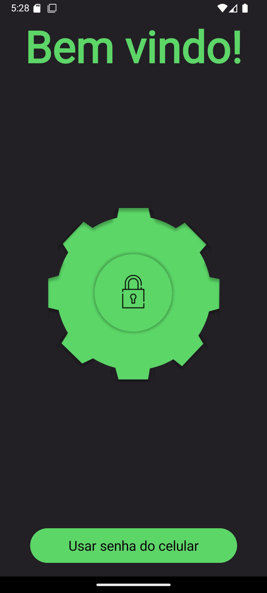
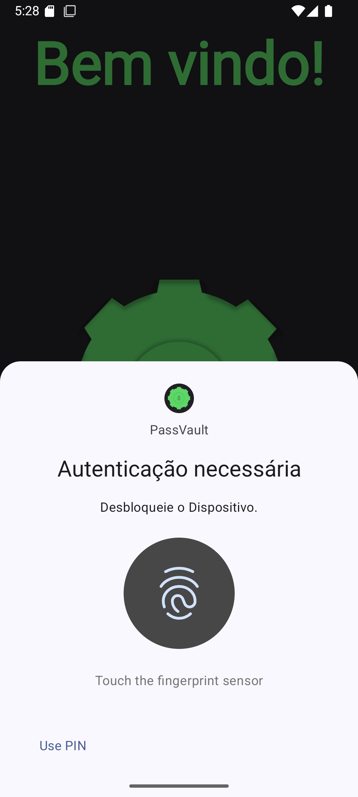
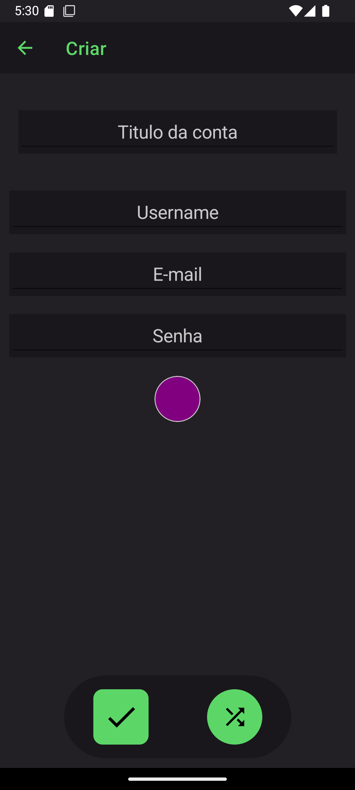
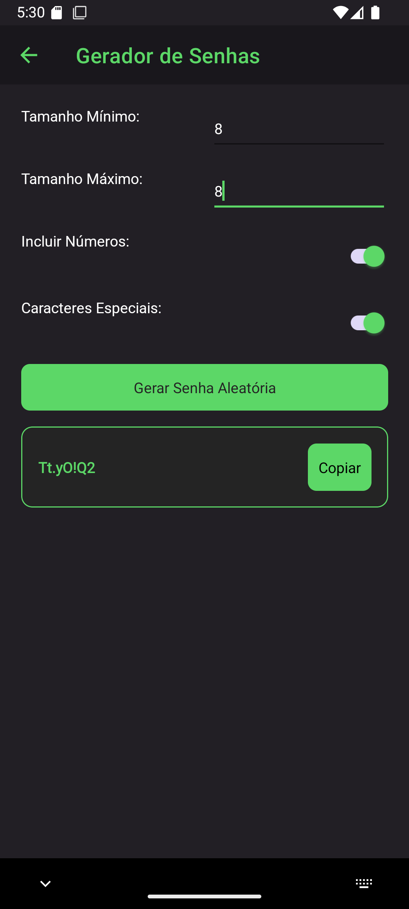
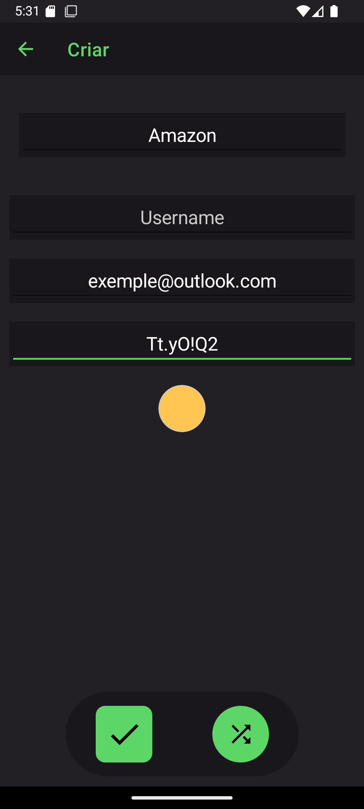
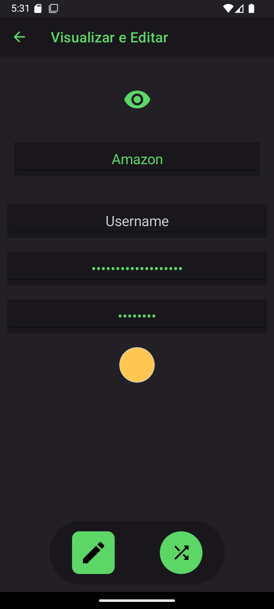
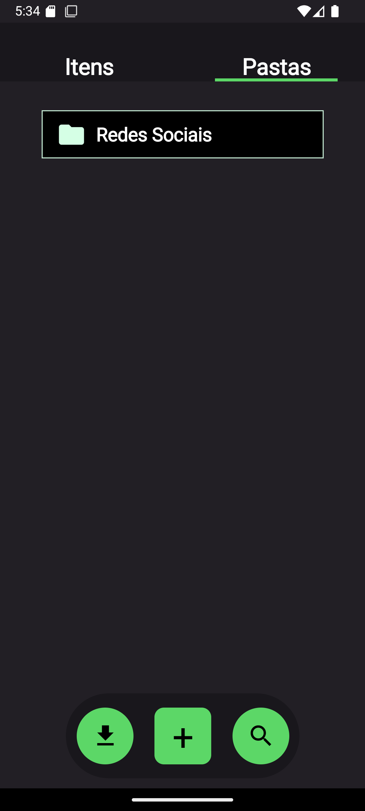
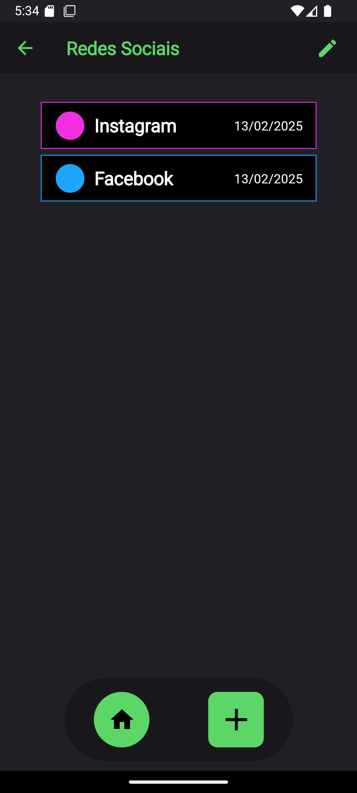

# **📱 OrionVault - Seu Gerenciador de Senhas Seguro**

OrionVault é um aplicativo Android desenvolvido com **.NET MAUI**, pensado para oferecer segurança, simplicidade e praticidade no gerenciamento de senhas. Organize e proteja suas informações com criptografia avançada e funcionalidades que garantem o acesso rápido e seguro às suas contas.

---

## 🚀 **Principais Funcionalidades**

- 🔑 **Criação de Senhas:** Gere senhas seguras automaticamente ou crie suas próprias.  
- 📂 **Organização Personalizada:** Agrupe suas contas em pastas para manter tudo organizado.  
- 🔒 **Criptografia de Senhas:** Proteção garantida com criptografia **AES** avançada.  
- 💾 **Armazenamento Local:** Seus dados são armazenados localmente com **SQLite**, sem necessidade de internet.  
- 🔐 **Exportação e Importação Segura:** Exporte e importe suas contas com proteção por senha.  
- 📱 **Segurança Adicional:** Utilize a senha do dispositivo para garantir que apenas você possa acessar suas informações.  

---

## 🛠️ **Stack Tecnológica**

- **.NET MAUI** – Framework para desenvolvimento de aplicativos multiplataforma.  
- **SQLite** – Banco de dados local para armazenamento eficiente e seguro.  
- **AES Encryption** – Garantia de segurança com criptografia avançada das senhas.  
- **MVVM Architecture** – Separação clara entre lógica de negócio e interface de usuário.  

---

## 📸 **Screenshots**

  
  
  
  
  
  
  
  

---

## 📦 **Download**

Baixe a versão mais recente diretamente na aba de [**Releases**](../../releases).

---

## 📝 **Licença**

Este projeto está licenciado sob a licença MIT - veja o arquivo [LICENSE](LICENSE) para mais detalhes.
